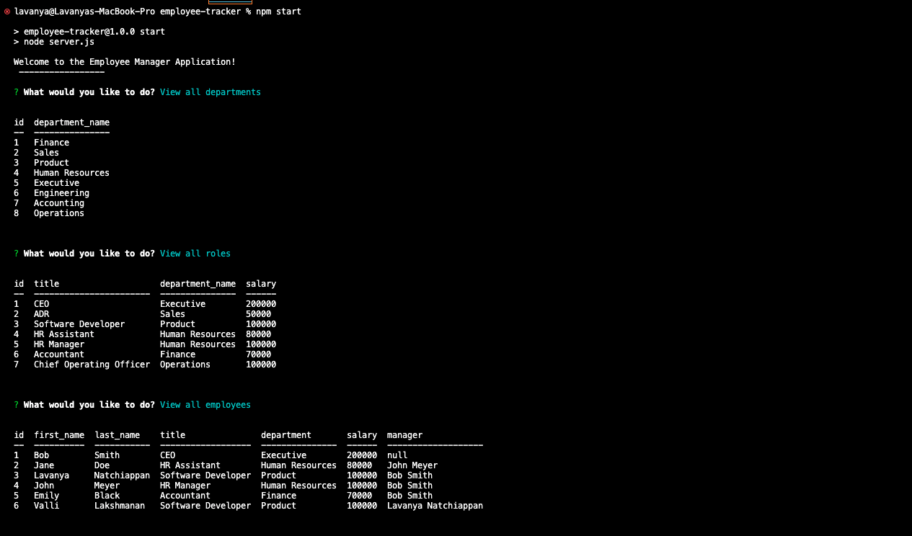

# employee-tracker
A command-line application to manage a company's employee database, using Node.js, Inquirer, and MySQL

## Description

Users are presented with a list of options in the terminal to add and update their company's departments, roles, and employees.

## Usage

You can use this application to maintain your company's departments, roles, and employees.

## Link to Video Walkthrough

[Video Walkthrough](https://drive.google.com/file/d/14oiglgXI97hz1gO3i1F4yTtoOr9WSnrS/view?usp=sharing)

## Screenshot of Application

